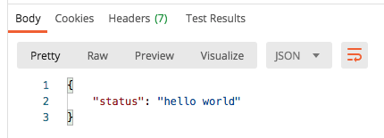

# Express API Demo

Small demo creating Express back-end to then connect with React front-end.

## Get started...

```sh
npm init -y
npm i express morgan
touch index.js
```

## Set up basic Express app

```js
const http = require('http');
const express = require('express');

const app = express();
const server = http.createServer(app);

const port = 5000;
const host = 'localhost';

const morgan = require('morgan');
const logger = morgan('dev');

app.use(logger);

server.listen(port, host, () => {
	console.log(`Express API listening at: http://${host}:${port}`);
});
```

## Create initial .get request to confirm Express app is functioning properly

```js
app.get('/api', (req, res) => {
	res.json({
		status: 'hello world',
	});
});
```

Use Postman to check using GET request:

```sh
http://localhost:5000/api
```

Working 😊



## Connecting React front-end API requests to Express back-end

Add to React `package.json file`:

```sh
  "proxy": "http://localhost:5000",
```

This will 'forward' API requests from fron-end over to back-end.

## Render initial route in frontend

In `App.jsx`, add `useEffect()` with `axios` to request data from backend.

```sh
useEffect(() => {
		axios.get('/api').then((response) => {
			console.log(response.data);
			setData(response.data);
		});
	}, []);
```

Add `data` prop to `App()`:

```jsx
<Switch>
    <Route exact path="/">
        <Home data={data} />
    </Route>
```

Then, pass prop into Home component:

```jsx
const Home = (props) => {
	return (
		<>
			<h1>Home Page</h1>
			<p>{props.data.status}</p>
		</>
	);
};
```

Run backend in terminal `node index.js` and frontend React `npm start`.

Webpage should render 'hello world' 😌
